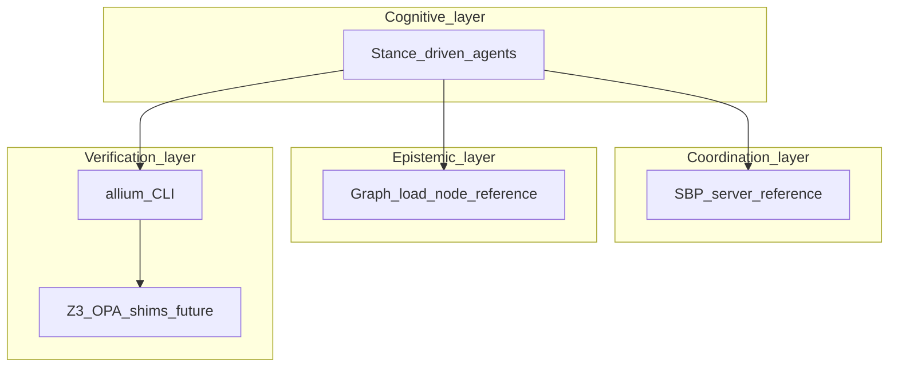

# Technical design document

This document describes the **reference architecture** for the Sublate Plurality SDLC. Components are tagged **concrete** (exists in this repo today), **partial** (tooling without full runtime), or **conceptual** (design target; not implemented).

## Design goals

1. **Bus topology over star orchestration** for coordination stories: a shared medium (specs + optional ledger) rather than one mega-prompt owning all state.
2. **Externalized belief** — architectural claims belong in artefacts (graphs, specs, RTM), not solely in volatile context.
3. **Verification layering** — LLM proposes; deterministic tools dispose where available (see [ADR-0004](adr/0004-verification-stack-layering.md)).

## Logical architecture

### Layer notes

**Orchestrator vs medium:** Hierarchical agent harnesses (for example OpenCode with the [oh-my-openagent](https://github.com/code-yeongyu/oh-my-openagent) plugin) optimize **who delegates to whom**. This repository implements the **shared medium** row below (graph + ledger + specs + verification), not another in-tree Sisyphus-style orchestrator.

| Layer | Component | Technology (essay / options) | Status |
|-------|-----------|------------------------------|--------|
| Cognitive | Stance-driven agents | OpenCode + plugins (e.g. [oh-my-openagent](https://github.com/code-yeongyu/oh-my-openagent)), in-tree stigmergy bridge ([`packages/opencode-plugin`](../../packages/opencode-plugin/) — [ADR-0012](adr/0012-opencode-plugin-architecture.md), FR-5.x), Cursor, other editors and models | **Concrete** for OpenCode via in-tree plugin (`StigmergyPlugin`, Phase **11** complete per [ROADMAP.md](ROADMAP.md)); other editors remain external |
| Coordination | SBP server | Node (in-process), SSE ([`packages/sbp-server`](../packages/sbp-server)); optional JSONL ledger ([ADR-0008](adr/0008-sbp-persistence.md)); optional SQLite ([ADR-0011](adr/0011-sbp-sqlite-store.md)) | **Concrete** (reference slice; **Redis not pursued** — [BACKLOG.md](BACKLOG.md)) |
| Epistemic | Graph engine / `load_node` | Python ([`packages/graph`](../packages/graph)); SQLite opt-in ([ADR-0007](adr/0007-graph-persistence.md)); Tree-sitter **Python + TypeScript/TSX** symbol / method / decorator cards when bindings are installed; shell line cards + `SOURCES` (no Tree-sitter for shell) | **Concrete (in-memory + SQLite)** — cards, `IMPORTS` / `SOURCES` / `CALLS`, CLI per [ADR-0002](adr/0002-relation-first-retrieval.md) |
| Verification | Allium tools | Rust CLI / LSP ([allium-tools](https://github.com/juxt/allium-tools)) | **Concrete** — user supplies CLI |
| Verification | Sublation bridge | Z3 on golden SMT ([`scripts/verify-smt-golden.sh`](../scripts/verify-smt-golden.sh)); `allium model` → SMT subset + solve path ([`packages/crucible`](../packages/crucible)); maintainer shim ([`devtools/crucible-shim`](../devtools/crucible-shim)); CI budget + secret-scan per [ROADMAP.md](ROADMAP.md) Phase 7–8 | **Partial** per [ADR-0006](adr/0006-p4-crucible-execution.md) — **scoped** golden compile + solve + shim contracts; **not pursued:** essay-scale ContextCov / Hashline AST parity and org-wide OPA/PATH enforcement ([ADR-0004](adr/0004-verification-stack-layering.md), [BACKLOG.md](BACKLOG.md)) |

## Data artefacts

### Agent stance configuration (reference)

Agents may carry a **stance vector** and **olfactory threshold** as in the inspiration doc. **Normative serialisation** for standalone stance configuration files is defined in [ADR-0010](adr/0010-stance-configuration-schema.md): JSON Schema [`packages/stance/schema/stance-config.schema.json`](../packages/stance/schema/stance-config.schema.json), Python validator [`packages/stance/src/stance/validate.py`](../packages/stance/src/stance/validate.py), optional SBP allow-list via `SBP_STANCE_REGISTRY`.

### Pheromone record

Normative JSON Schema: [`packages/sbp-server/schemas/pheromone.json`](../packages/sbp-server/schemas/pheromone.json). The in-repo server validates POST bodies against required fields (`id`, `stanceTarget`, `baseIntensity`, `decayRate`).

## Critical workflows

### Hound retrieval flow (mitigating belief collapse)

**Trigger:** Agent follows a graph or ledger signal to a node.  
**Request:** `load_node(id)` (name illustrative).  
**Steps:** Traverse stored edges → aggregate byte-accurate slices → return minimal context.  
**Status:** **Concrete** for the Python reference implementation ([`packages/graph`](../packages/graph)); expand to multi-language AST cards via ADR-0002 revision when needed.

### Sublation verification flow (mitigating context drift)

**Trigger:** Mutation proposed (e.g. commit).  
**Steps (essay):** Hook → parse Allium → compile to SMT → extract code facts → Z3 → sat/unsat with trace.  
**Today:** **Allium CLI validation** of specs remains the primary spec gate. **Additionally:** [`packages/crucible`](../packages/crucible) compiles `allium model` JSON to SMT-LIB with committed goldens (`scripts/verify-crucible-compile.sh`); `z3` runs on every `*.smt2` under `tests/fixtures/crucible/`; `python3 -m crucible.cli solve spec/` checks transition-bearing modules for **sat** and [`packages/crucible`](../packages/crucible) maps **unsat** cores to labelled assertions ([ADR-0006](adr/0006-p4-crucible-execution.md)).

## FR-1.3 (implemented) — transition hooks

**Today:** [`spec/governance.allium`](../spec/governance.allium) models `TraceabilityRow`, `Pheromone` transitions, and governance slices for stance targets, ledger stores, code cards, and aspect edges (aligned with shipped packages). The vendor CLI **`allium model <file.allium>`** emits structured JSON (`transition_graphs` per entity); [`packages/transitions`](../packages/transitions/) merges every `spec/*.allium` model and exposes `TransitionTable.from_allium_specs(spec_dir)`. The heavy CI job runs `unittest` with `allium` on `PATH` so disallowed jumps fail the build.

1. **Naming:** transition edges live only in `.allium`; no checked-in JSON sidecar.
2. **Test harness:** Python `unittest` under `packages/transitions/tests/`.
3. **RTM:** FR-1.3 is `implemented` with `allium model` as the single source.

## Open questions

1. ~~Which canonical graph representation~~ **Resolved for now:** in-tree Python cards under `packages/graph`; revisit if SQLite + Tree-sitter ingestion is required.
2. How will **liquid delegation** avoid power clumping if used (see ADR-0005)?
3. ~~What is the **minimum** unsat-core UX~~ **Baseline shipped:** `explain_core` lists assertion ids with entity/field/kind plus a source excerpt; deepen span-accurate mapping when `allium parse` exposes stable rule handles.

## Related documents

- [PRD.md](PRD.md) — vision and phases.  
- [ROADMAP.md](ROADMAP.md) — ordered implementation program vs the inspiration essay; updates here should follow phase completions.  
- [requirements/FR.md](requirements/FR.md) — functional requirements.  
- [adr/](adr/) — decisions and maturity boundaries.
