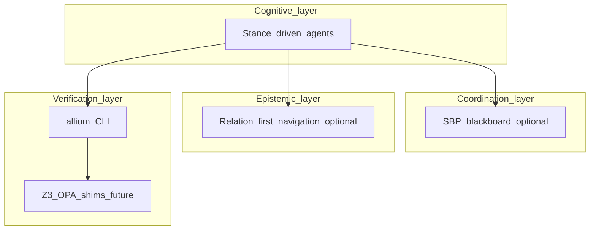

# Technical design document

This document describes the **reference architecture** for the Sublate Plurality SDLC. Components are tagged **concrete** (exists in this repo today), **partial** (tooling without full runtime), or **conceptual** (design target; not implemented).

## Design goals

1. **Bus topology over star orchestration** for coordination stories: a shared medium (specs + optional ledger) rather than one mega-prompt owning all state.
2. **Externalized belief** — architectural claims belong in artefacts (graphs, specs, RTM), not solely in volatile context.
3. **Verification layering** — LLM proposes; deterministic tools dispose where available (see [ADR-0004](adr/0004-verification-stack-layering.md)).

## Logical architecture

### Layer notes

| Layer | Component | Technology (essay / options) | Status |
|-------|-----------|------------------------------|--------|
| Cognitive | Stance-driven agents | OpenCode, editors, vendor models | **Concrete** (tooling assumed) |
| Coordination | SBP server | Node (in-process), SSE ([`packages/sbp-server`](../packages/sbp-server)) | **Concrete** (reference slice; Redis optional later) |
| Epistemic | Graph engine / `load_node` | Python ([`packages/graph`](../packages/graph)); SQLite/Tree-sitter TBD | **Partial** — cards + IMPORTS graph + CLI |
| Verification | Allium tools | Rust CLI / LSP ([allium-tools](https://github.com/juxt/allium-tools)) | **Concrete** — user supplies CLI |
| Verification | Sublation bridge | Z3 on golden SMT ([`scripts/verify-smt-golden.sh`](../scripts/verify-smt-golden.sh)); shim prototype ([`devtools/crucible-shim`](../devtools/crucible-shim)) | **Partial** per [ADR-0006](adr/0006-p4-crucible-execution.md) |

## Data artefacts

### Agent stance configuration (reference)

Agents may carry a **stance vector** and **olfactory threshold** as in the inspiration doc. Serialisation format is **not fixed** until an implementation ADR defines it.

### Pheromone record

Normative JSON Schema: [`packages/sbp-server/schemas/pheromone.json`](../packages/sbp-server/schemas/pheromone.json). The in-repo server validates POST bodies against required fields (`id`, `stanceTarget`, `baseIntensity`, `decayRate`).

## Critical workflows

### Hound retrieval flow (mitigating belief collapse)

**Trigger:** Agent follows a graph or ledger signal to a node.  
**Request:** `load_node(id)` (name illustrative).  
**Steps:** Traverse stored edges → aggregate byte-accurate slices → return minimal context.  
**Status:** **Concrete** for the Python reference implementation ([`packages/graph`](../packages/graph)); expand to multi-language AST cards via ADR-0002 revision when needed.

### Sublation verification flow (mitigating context drift)

**Trigger:** Mutation proposed (e.g. commit).  
**Steps (essay):** Hook → parse Allium → compile to SMT → extract code facts → Z3 → sat/unsat with trace.  
**Today:** **Allium CLI validation** of specs remains the primary spec gate. **Additionally:** curated golden `.smt2` under `tests/fixtures/crucible/` is checked with `z3` in CI ([ADR-0006](adr/0006-p4-crucible-execution.md)). Automated Allium→SMT translation is **not** claimed as `implemented` until golden outputs are produced by a checked-in compiler.

## FR-1.3 (planned) — transition hooks

When domain `.allium` gains `when` / `requires` / `ensures` transition graphs:

1. **Naming:** each transition edge gets a stable identifier in spec (entity-level or module-level).
2. **Test harness (future):** generated or hand-written tests assert disallowed state jumps fail CI (language: Python `unittest` or project default at that time).
3. **RTM:** FR-1.3 row links spec paths + test command; no maturity upgrade until harness exists.

## Open questions

1. ~~Which canonical graph representation~~ **Resolved for now:** in-tree Python cards under `packages/graph`; revisit if SQLite + Tree-sitter ingestion is required.
2. How will **liquid delegation** avoid power clumping if used (see ADR-0005)?
3. What is the **minimum** unsat-core UX for humans if Z3 is introduced?

## Related documents

- [PRD.md](PRD.md) — vision and phases.  
- [ROADMAP.md](ROADMAP.md) — ordered implementation program vs the inspiration essay; updates here should follow phase completions.  
- [requirements/FR.md](requirements/FR.md) — functional requirements.  
- [adr/](adr/) — decisions and maturity boundaries.
