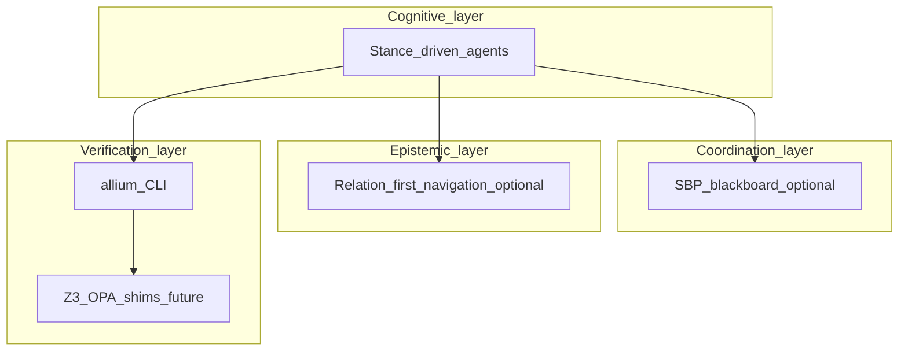

# Technical design document

This document describes the **reference architecture** for the Sublate Plurality SDLC. Components are tagged **concrete** (exists in this repo today), **partial** (tooling without full runtime), or **conceptual** (design target; not implemented).

## Design goals

1. **Bus topology over star orchestration** for coordination stories: a shared medium (specs + optional ledger) rather than one mega-prompt owning all state.
2. **Externalized belief** — architectural claims belong in artefacts (graphs, specs, RTM), not solely in volatile context.
3. **Verification layering** — LLM proposes; deterministic tools dispose where available (see [ADR-0004](adr/0004-verification-stack-layering.md)).

## Logical architecture

### Layer notes

| Layer | Component | Technology (essay / options) | Status |
|-------|-----------|------------------------------|--------|
| Cognitive | Stance-driven agents | OpenCode, editors, vendor models | **Concrete** (tooling assumed) |
| Coordination | SBP server | Node/TS, Redis, SSE (essay) | **Conceptual** for this repo |
| Epistemic | Hound-style graph engine | Python, NetworkX, SQLite, Tree-sitter (essay) | **Conceptual** |
| Verification | Allium tools | Rust CLI / LSP ([allium-tools](https://github.com/juxt/allium-tools)) | **Concrete** — user supplies CLI |
| Verification | Sublation bridge | Z3, OPA, AST to SMT (essay) | **Conceptual** until implemented |

## Data artefacts

### Agent stance configuration (reference)

Agents may carry a **stance vector** and **olfactory threshold** as in the inspiration doc. Serialisation format is **not fixed** until an implementation ADR defines it.

### Pheromone record (reference)

Fields such as `pheromone_uuid`, `intent_reference`, `decay_rate`, `lock_status` illustrate the coordination story. Schema is **not normative** until an SBP implementation exists.

## Critical workflows

### Hound retrieval flow (mitigating belief collapse)

**Trigger:** Agent follows a graph or ledger signal to a node.  
**Request:** `load_node(id)` (name illustrative).  
**Steps:** Traverse stored edges → aggregate byte-accurate slices → return minimal context.  
**Status:** **Conceptual** until a graph implementation exists.

### Sublation verification flow (mitigating context drift)

**Trigger:** Mutation proposed (e.g. commit).  
**Steps (essay):** Hook → parse Allium → compile to SMT → extract code facts → Z3 → sat/unsat with trace.  
**Today:** **Allium CLI validation** of specs is the supported deterministic step; SMT/Z3 remains **design** (ADR-0004).

## Open questions

1. Which **canonical graph** representation will the project adopt (if any): Hound-style, internal, or vendor?
2. How will **liquid delegation** avoid power clumping if used (see ADR-0005)?
3. What is the **minimum** unsat-core UX for humans if Z3 is introduced?

## Related documents

- [PRD.md](PRD.md) — vision and phases.  
- [requirements/FR.md](requirements/FR.md) — functional requirements.  
- [adr/](adr/) — decisions and maturity boundaries.
